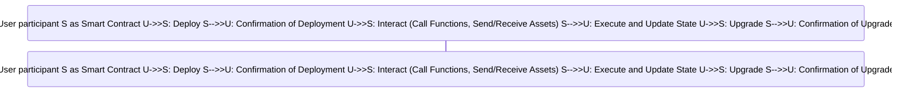
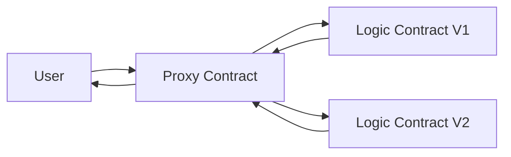
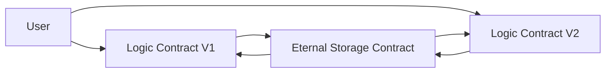
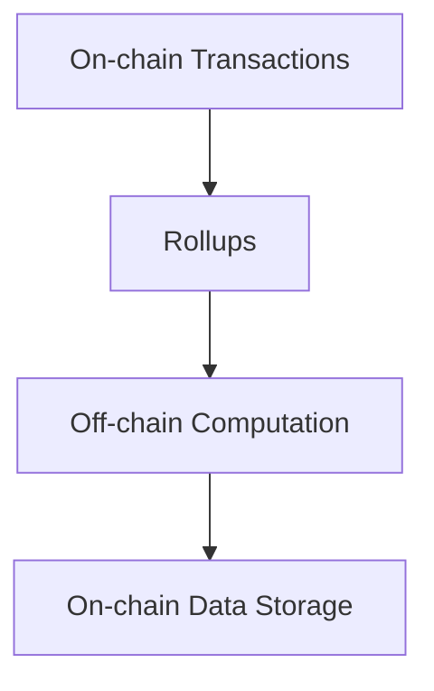
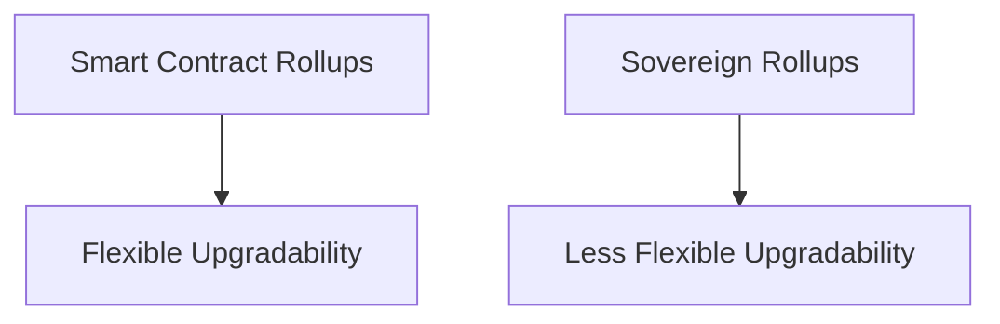

# Avail documentation task
## Part 1: Conceptual Documentation
# Topic 1: Smart Contract Upgrades on Ethereum and Approaches
## What are Smart Contracts?

Smart contracts are self-executing contracts with the terms of the agreement directly written into code. They exist across a decentralized blockchain network, and they control the transfer of digital currencies or assets between parties under certain conditions.

A smart contract not only defines the rules and penalties related to an agreement in the same way a traditional contract does, but it can also automatically enforce those obligations. It does this by taking in information as input, assigning value to that input through the rules set out in the contract, and executing the actions required by those contractual clauses.

### Detailed Explanation of Smart Contracts

Smart contracts are not just simple contracts written into code, they are more like programmable scripts that run on the Ethereum blockchain. They are capable of handling and executing a wide range of tasks from simple transfers of tokens to complex decentralized applications. They are executed by the Ethereum Virtual Machine (EVM) on each node in the Ethereum network, ensuring that the results are valid and agreed upon by all participants in the network.

### Smart Contract Lifecycle


## What is a Smart Contract Upgrade?

While the immutability of smart contracts is a key feature that ensures trust and reliability, it can also be a limitation when it comes to improving the functionality of these contracts. This is where the concept of "upgradeable" smart contracts comes in.

An upgradeable smart contract is not mutable in the traditional sense. Instead, it uses a special feature called a `proxy pattern` that allows developers to modify the contract's logic post-deployment. This is achieved by separating the contract into two parts: the proxy contract and the logic contract.

The proxy contract is responsible for maintaining the contract's state and balance, while the logic contract contains the code that governs the contract's behavior. When a user interacts with the contract, their call is routed through the proxy to the logic contract, which executes the required functions and returns the result via the proxy.

### Necessity of Smart Contract Upgrades

Smart contracts, once deployed, are immutable. This means that their code cannot be changed, which is a feature that ensures trust and security in the contract. However, this also poses a challenge when there are bugs in the contract or when there's a need to add new features or improve functionality. This is where the concept of `upgradeable` smart contracts comes in. Upgrades allow developers to modify the contract's logic post-deployment, providing a way to fix bugs, add new features, or make other necessary changes.

## Approaches to Upgrading Ethereum Smart Contracts
### Manual Migration

This is the simplest form of upgrade where you deploy a new contract and manually move the data from the old one to the new one. While this approach is straightforward, it can be laborious and error-prone, especially for contracts with complex data structures or large amounts of data.

Here's a basic illustration of how this process works:

  ```mermaid 
graph TB;  
A[Old Contract with Data and Logic] -->|Deploy new contract| B[New Contract with New Logic]; A -->|Move Data| B;  
style A fill:#f9f,stroke:#333,stroke-width:2px  
style B fill:#ccf,stroke:#f66,stroke-width:2px,stroke-dasharray: 5, 5
```

### Proxy/Delegate Pattern

The proxy/delegate pattern is one of the most common methods for upgrading Ethereum smart contracts. In this pattern, the proxy contract maintains the state and balance of the smart contract, while the logic contract contains the code that governs the contract's behavior.

When a user interacts with the contract, their call is routed through the proxy to the logic contract, which executes the required functions and returns the result via the proxy. The logic contract can be replaced with a new version, allowing the behavior of the contract to be upgraded without affecting the contract's state or balance.


### Eternal Storage Pattern

The Eternal Storage pattern is another approach to upgradeability. In this pattern, the state of the contract is stored in a separate contract, known as the Eternal Storage contract. This contract is never upgraded, ensuring that the state is preserved across upgrades.

The logic contracts can be upgraded, and they interact with the Eternal Storage contract to read and write state. This allows the behavior of the contract to be upgraded without affecting the contract's state.


### Diamond Pattern

The Diamond pattern, also known as the `Diamond Standard` or EIP-2535, is a more advanced approach to smart contract upgradeability. This pattern allows a contract to use multiple logic contracts, each of which can be upgraded independently. This provides a high degree of flexibility and modularity, as different aspects of the contract's behavior can be upgraded separately.

In the Diamond pattern, the contract maintains a mapping of function selectors to logic contracts. When a function is called, the contract looks up the corresponding logic contract and delegates the call to it. This allows the contract to have more than 24 functions and to group related functions together in the same logic contract.


## Considerations When Upgrading Smart Contracts

When upgrading smart contracts, there are several important considerations to keep in mind:

-   **State Preservation**: The upgrade should not affect the existing state of the contract, including the data stored in the contract and the Ether balance of the contract. This is why most upgrade patterns involve separating the contract's state from its logic.

-   **Address Preservation**: The address of the contract should not change after the upgrade, as other contracts or users may have stored this address for interaction. This is why most upgrade patterns involve using a proxy contract, which maintains the same address across upgrades.

-   **Event Handling**: If the contract emits events, the upgrade should ensure that these events are still emitted correctly and can be tracked by the applications. This requires careful design of the upgrade mechanism to ensure that events are not lost or duplicated during the upgrade.

-   **Security**: The upgrade process should not introduce security vulnerabilities. For example, the delegatecall function can change the contract's state, so it should be used carefully. Additionally, the upgrade mechanism should be secure against unauthorized upgrades, which could be used to change the contract's behavior maliciously.

-   **Governance**: The process of deciding when and how to upgrade the contract should be transparent and fair. This could involve a voting mechanism, where the contract's stakeholders can vote on proposed upgrades. The governance process should also be resistant to manipulation, such as `sybil attacks` where a single party creates multiple identities to influence the outcome of a vote.
### Detailed Considerations When Upgrading Smart Contracts

When upgrading smart contracts, it's important to consider not just the technical aspects, but also the potential impact on users and other stakeholders. For example, preserving the contract's state and address is crucial for ensuring that users can continue to interact with the contract as expected. However, upgrades also need to be handled carefully to avoid introducing new security vulnerabilities or disrupting the contract's event handling. Additionally, the process of deciding when and how to upgrade the contract should be transparent and fair, to ensure that all stakeholders havea say in the contract's evolution.

## Pros and Cons of Upgrading Smart Contracts
| Pros | Cons |  
| --- | --- |  
| Allows for the correction of bugs and vulnerabilities discovered after deployment. | Breaks the immutability guarantee of smart contracts, which can lead to trust issues. |  
| Enables the addition of new features and improvements over time. | Adds complexity to the contract, which can increase the risk of bugs and vulnerabilities. |  
| Can improve the user experience by allowing for changes in response to user feedback. | Requires careful design and governance to prevent unauthorized or malicious upgrades. |  
| Can extend the lifespan of a contract by allowing it to adapt to changes in the environment or requirements. | Can lead to centralization if the power to upgrade the contract is held by a single party. |  


Upgrading smart contracts has many benefits, such as the ability to fix bugs, add new features, and improve the user experience. However, it also has potential downsides, such as increased complexity and the risk of introducing new bugs or security vulnerabilities. It's also important to consider the potential impact on the contract's users and other stakeholders, as well as the broader implications for the trust and security of the Ethereum ecosystem.

## Resources

- [Ethereum Smart Contract Upgradeability](https://ethereum.org/en/developers/docs/smart-contracts/anatomy/#upgradeability)
- [OpenZeppelin Upgrades Plugins](https://docs.openzeppelin.com/upgrades-plugins/1.x/)
- [EIP-2535: Diamond Standard](https://eips.ethereum.org/EIPS/eip-2535)
- [Solidity Delegatecall Function](https://solidity.readthedocs.io/en/v0.5.3/assembly.html#delegatecall)

The resources provided offer a wealth of information on smart contract upgrades. For example, the Ethereum Smart Contract Upgradeability link provides a deep dive into the technical aspects of upgradeability, while the `OpenZeppelin` Upgrades Plugins link offers practical tools and plugins for implementing upgrades. `The EIP-2535: Diamond` Standard link provides information on the Diamond pattern, a more advanced approach to upgradeability. The Solidity Delegatecall Function link provides detailed information on the delegatecall function, a key feature used in many upgrade patterns.

# The Difference Between Smart Contract Rollups and Sovereign Rollups in Terms of Their Upgradability

## Understanding Rollups in Ethereum

Rollups are layer-2 scaling solutions that keep transaction data on-chain but push computation off-chain. This means that all the transaction data is processed off-chain and only the necessary information is stored on the Ethereum mainnet. This approach significantly reduces the load on the Ethereum network, allowing it to process more transactions per second and thus improving its scalability.


## Smart Contract Rollups vs Sovereign Rollups

### Smart Contract Rollups

Smart contract rollups are rollups where the layer-2 solution supports smart contracts. This means that not just transactions, but any arbitrary smart contract can be executed off-chain. The state of these smart contracts is then rolled up and stored on the Ethereum mainnet. This allows developers to create complex decentralized applications that can scale without overloading the Ethereum network.

### Sovereign Rollups

Sovereign rollups, on the other hand, are rollups that have their own set of rules and don't necessarily support smart contracts. They are independent layer-2 solutions that have their own consensus mechanisms and security models. They can process transactions off-chain, but they don't support the execution of arbitrary smart contracts.  
|                       | Smart Contract Rollups | Sovereign Rollups |  
|-----------------------|------------------------|-------------------|  
| Supports Smart Contracts | Yes                  | No                |  
| Independent Consensus | No                   | Yes               |  
| Own Security Model   | No                   | Yes               |


## Upgradability of Rollups

The upgradability of rollups depends on the type of rollup. In general, smart contract rollups might be more flexible in terms of upgrading since the smart contracts themselves can be upgraded. This allows developers to add new features, fix bugs, or improve the functionality of their decentralized applications without needing to deploy a new rollup.

Sovereign rollups, on the other hand, might be less flexible in terms of upgradability. Since they have their own consensus mechanisms and security models, upgrading these rollups might require consensus from the network participants and could potentially be more complex and time-consuming.



# Part 2: Example Documentation

In this part, we will walk through the process of setting up a local Ethereum Virtual Machine (EVM) smart contract environment. This environment will allow us to write, compile, and deploy Ethereum smart contracts. We'll be using Truffle, Ganache, and MetaMask to accomplish this.

- **Truffle** is a development environment, testing framework, and asset pipeline for Ethereum, aiming to make life as an Ethereum developer easier.
- **Ganache** is a personal blockchain for Ethereum development you can use to deploy contracts, develop applications, and run tests.
- **MetaMask** is a browser extension that allows you to interact with the Ethereum blockchain, including smart contracts and Ethereum accounts, right from your browser.

Here's what we'll cover:

1. Installing prerequisites: Node.js and npm
2. Installing Truffle and Ganache
3. Creating a new Truffle project
4. Writing a "Hello World" smart contract
5. Compiling and deploying the smart contract using Truffle and Ganache
6. Interacting with the smart contract using Truffle
7. Connecting MetaMask to our local Ethereum blockchain provided by Ganache
8. Interacting with the deployed smart contract through MetaMask

By the end of this guide, you'll have a local Ethereum development environment set up, and you'll deploy and interact with a "Hello World" smart contract.

Let's get started!

## 2.1 Installing Prerequisites: Node.js and npm

Before we can install Truffle and Ganache, we need to make sure we have Node.js and npm installed. Node.js is a JavaScript runtime that lets you run JavaScript on your computer, and npm (Node Package Manager) is a tool that allows you to install JavaScript packages.

1. To install Node.js and npm, visit the [official Node.js website](https://nodejs.org/) to download the installer.
2. Choose the version that is appropriate for your operating system (Windows, MacOS, Linux). If you're unsure which version to choose, select the LTS (Long Term Support) version. This version is tested and stable.
3. Download the installer and follow the prompts to install Node.js and npm. The npm tool is included with Node.js, so you get both when you install Node.js.

You can verify the installation by opening a new terminal window and running:

```bash  
node -vnpm -v```  
These commands should display the installed versions of Node.js and npm, respectively.  
  
## 2.2 Installing Truffle and Ganache  
  
With Node.js and npm installed, we can now install Truffle and Ganache. Open a terminal and run the following commands:  
```bash  
npm install -g truffle```  
The `-g` flag means we're installing these packages globally on our system, so we can use them from any directory.  
  
  **Ganache** installation guide can be found in [here](https://www.trufflesuite.com/ganache).  
    
## 2.3 Creating a New Truffle Project  
  
First, create a new directory for your project and navigate into it:  
```bash  
mkdir smart_contract_helloworld-main  
cd smart_contract_helloworld-main```  
Then, initialize a new Truffle project:  
```bash  
truffle init```  
This command creates a new Truffle project with all the necessary directories and files.  
Once this operation is completed, you'll now have a project structure with the following items:  
  
-   `contracts/`: Directory for  **Solidity contracts**  
-   `migrations/`: Directory for  **scriptable deployment files**  
-   `test/`: Directory for test files for  **testing your application and** -   `truffle-config.js`: Truffle  **configuration file**  
  
if you run the truffle init you should see a response similar to mine below  
  
```bash  
PS C:\Users\swarna\Desktop\hello-world\smart_contract_helloworld-main> truffle init Starting init...> Copying project files to C:\Users\Edeh Emmanuel\Desktop\hello-world\smart_contract_helloworld-main  
Init successful, sweet!Try our scaffold commands to get started:  $ truffle create contract YourContractName # scaffold a contract  $ truffle create test YourTestName         # scaffold a test  
http://trufflesuite.com/docs  
```  


## 2.4 Set up your smart contract

You should now have a `contracts` directory. In this directory, create a new file called `Main.sol` and paste your `Main` contract code in there

Here, you're setting up the smart contracts for your project. In the `contracts` directory, you're creating two files: `Main.sol` and `Migrations.sol`.

`Main.sol` contains your main smart contract, `Main`. This contract has a variable `name` and two functions: `setUserName` and `printMessage`. `setUserName` is used to set the value of `name`, while `printMessage` concatenates the string "Hello " with the value of `name` and "!" to create a personalized greeting.

`Migrations.sol` is a special contract that Truffle uses to keep track of which migrations (deployments) have been done and which haven't.!**

Open `Main.sol` in your text editor and add the following code:
```bash  
pragma solidity ^0.5.0;  
contract Main {  string name;  
 function setUserName(string memory userName) public { name = userName; }  
 function printMessage() public returns(string memory) {  bytes memory concat_strings; concat_strings = abi.encodePacked("Hello ");  
 concat_strings = abi.encodePacked(concat_strings, name);  
 concat_strings = abi.encodePacked(concat_strings, "!"); string memory message = string(concat_strings);  
 return message; }}  
  
```  
In the same directory `contracts` , you will create another file called `migrations.sol` the following content:

```bash  
pragma solidity >=0.4.21 <0.6.0;  
contract Migrations {  address public owner;  uint public last_completed_migration;  
  constructor() public {  
 owner = msg.sender; }  
  modifier restricted() { if (msg.sender == owner) _; }  
 function setCompleted(uint completed) public restricted { last_completed_migration = completed; }  
 function upgrade(address new_address) public restricted { Migrations upgraded = Migrations(new_address); upgraded.setCompleted(last_completed_migration); }}  
```  


## 2.5 Set up migrations

Next, you need to create a migration file to handle deploying your smart contract to your local blockchain. In the `migrations` directory, create a new file called `2_deploy_contracts.js` and paste your deployment code in there:  
In `2_deploy_contracts.js`:
```bash  
var Main = artifacts.require("./Main.sol");  
  
module.exports = function(deployer) {  deployer.deploy(Main);  
};  
```  

Migrations are JavaScript files that help you deploy contracts to the Ethereum network. These files are responsible for staging your deployment tasks, and they're written under the assumption that your deployment needs will change over time.

In the `migrations` directory, you're creating a new file called `2_deploy_contracts.js`. This file tells Truffle to deploy the `Main` contract when running migrations.

## 2.6 Set up tests
Next, we'll create a test for our contract. In the `test` directory, create a new file called `test.main.js` and paste your test code in there:

In `test.main.js`:
```bash  
const Main = artifacts.require('Main');  
  
contract('Main', function() {  
  it("should print out hello", function(){  
  return Main.deployed().then(function(instance) {  
  instance.setUserName("swarna");  
 return instance.printMessage.call();  
 }).then(function(msg) { assert.equal(msg, "Hello Swarna!", "should print out hello to entered name"); }); });});  
  
```  
Here, you're setting up tests for your contract. Tests help ensure your contract works as expected and allow you to catch any errors or bugs in your contract.

In the `test` directory, you're creating a new file called `test.main.js`. This file contains a test that checks whether the `printMessage` function of the `Main` contract returns the correct greeting.

## 2.7 Configure Truffle & Ganache
In this step, you're configuring Truffle to connect to your local Ethereum blockchain (provided by Ganache). This is done in the `truffle-config.js` file. You're telling Truffle to connect to the network at `127.0.0.1:7545`, which is the default network and port that Ganache creates.  
Make sure your `truffle-config.js` file (located in your project's root directory) matches the network configuration of your Ganache instance:

In `truffle-config.js`:
```bash  
module.exports = {  
 networks: { development: { host: "127.0.0.1", port: 7545, network_id: "*" // Match any network id } }};  
  
```  

## 2.8 Compile and migrate your contract

Go back to your project's root directory and compile your smart contract:

```bash  
 cd ..truffle compile  
```  
if you do the truffle compile, you should see an output simmilar to mine below

```bash  
PS C:\Users\swarna\Desktop\hello-world\smart_contract_helloworld-main> truffle compileCompiling your contracts...===========================  
> Compiling .\contracts\Main.sol  
> Compiling .\contracts\Migrations.sol  
> Compilation warnings encountered:  
 project:/contracts/Main.sol:10:5: Warning: Function state mutability can be restricted to view function printMessage() public returns(string memory) { ^ (Relevant source part starts here and spans across multiple lines).> Artifacts written to C:\Users\swarna\Desktop\hello-world\smart_contract_helloworld-main\build\contracts  
> Compiled successfully using:  
 - solc: 0.5.16+commit.9c3226ce.Emscripten.clang```  
  
Here, you're compiling and deploying your contract to the local Ethereum blockchain.  
  
When you run `truffle compile`, Truffle takes the contract code from your `.sol` files, turns it into a format that the Ethereum Virtual Machine (EVM) can understand, and outputs this into a `build` directory  
  
**Migrate**  
After successfully compiling the contract, Then migrate your smart contract to your local blockchain:   
```bash  
truffle migrate```  
  
if you run the truffle migrate, you should see an output similar to mine below  
```bash  
PS C:\Users\swarna\Desktop\hello-world\smart_contract_helloworld-main> truffle migrateCompiling your contracts...===========================  
> Compiling .\contracts\Main.sol  
> Compiling .\contracts\Migrations.sol  
> Compilation warnings encountered:  
 project:/contracts/Main.sol:10:5: Warning: Function state mutability can be restricted to view function printMessage() public returns(string memory) { ^ (Relevant source part starts here and spans across multiple lines).> Artifacts written to C:\Users\swarna\Desktop\hello-world\smart_contract_helloworld-main\build\contracts  
> Compiled successfully using:  
 - solc: 0.5.16+commit.9c3226ce.Emscripten.clangStarting migrations...  
======================  
> Network name:    'development'  
> Network id:      5777  
> Block gas limit: 6721975 (0x6691b7)  
2_deploy_contracts.js  
=====================  
 Deploying 'Main' ---------------- > transaction hash:    0xeb3c9ea5448413e3e5053e67db86fa5f7203ebb8993f55e381da9b4d47d7613a > Blocks: 0            Seconds: 0 > contract address:    0x0480BC086395823B53c71D7b8cC837111B667f09 > block number:        1 > block timestamp:     1688126174 > account:             0xAf359Ab78449c22613E24471fF79739AA8A20D7f > balance:             99.999055205875 > gas used:            279939 (0x44583) > gas price:           3.375 gwei > value sent:          0 ETH > total cost:          0.000944794125 ETH > Saving artifacts ------------------------------------- > Total cost:      0.000944794125 ETHSummary  
=======  
> Total deployments:   1  
> Final cost:          0.000944794125 ETH  
```  
when you run `truffle migrate`, Truffle runs the migration scripts you've set up. These scripts deploy your compiled contracts to the Ethereum network (in this case, the local network provided by Ganache).

## Test your contract

You can now run your tests to make sure your contract works as expected:

```bash  
truffle test  
```  

In this step, you're running your tests to make sure your contract works as expected. When you run `truffle test`, Truffle compiles your contracts, deploys them to the local Ethereum blockchain, runs your tests, and provides you with the results.

## 2.9 Interact with your contract

we will be using truffle console
```bash  
truffle console
**Step 1:** Open the Truffle console.    
This is done using the command `truffle console` in your terminal. This will open an interactive shell where you can interact with your deployed smart contracts.  
  
**Step 2:** Declare a variable to hold an instance of your smart contract.    
This is done using the command `var hw;`. The variable `hw` will be used to hold an instance of your deployed smart contract.  
  
**Step 3:** Assign the deployed instance of your smart contract to the variable.    
This is done using the command `Main.deployed().then(function(instance) { hw = instance; });`. This command uses the `deployed()` function to get the deployed instance of your `Main` smart contract and then assigns that instance to the `hw` variable. This is done asynchronously, so a promise is used to ensure the instance is assigned after it's fetched.  
  
**Step 4:** Call a function on your smart contract.    
This is done using the command `hw.setUserName("swarna")`. This command calls the `setUserName` function of your smart contract and passes the string `"swarna"` as an argument. This function sets the `name` variable in your smart contract to `"Ahmet"`. The command returns a transaction receipt, which includes information about the transaction.  
  
**Step 5:** Call another function on your smart contract.    
This is done using the command `hw.printMessage.call()`. This command calls the `printMessage` function on your smart contract, which concatenates the string "Hello " with the name stored in your smart contract and returns it. Since you previously set the name to `"swarna"`, you see `'Hello swarna!'` as the output.  
  
**Step 6:** Exit the Truffle console.    
This is done using `.exit` command. It will close the interactive Truffle console and return you to your terminal.  
  
if you followed this step this will be your output   
  
```bash  
PS C:\Users\swarna\Desktop\hello-world\smart_contract_helloworld-main> truffle consoletruffle(development)> var hw;  
undefined  
truffle(development)> Main.deployed().then(function(instance) { hw = instance; });  
undefined  
truffle(development)> hw.setUserName("swarna")  
{  
 tx: '0xc364c8c457175747b480a3829ee2996771ad73f05888b36a4468742a7a5251e5', receipt: { transactionHash: '0xc364c8c457175747b480a3829ee2996771ad73f05888b36a4468742a7a5251e5', transactionIndex: 0, blockNumber: 2, blockHash: '0xa02116d5e96757a6a64f424764e244a245c15b4007d9bc8e665d6a345274b564',    from: '0xaf359ab78449c22613e24471ff79739aa8a20d7f',  
 to: '0x0480bc086395823b53c71d7b8cc837111b667f09', cumulativeGasUsed: 44516, gasUsed: 44516, contractAddress: null, logs: [], logsBloom: '0x00000000000000000000000000000000000000000000000000000000000000000000000000000000000000000000000000000000000000000000000000000000000000000000000000000000000000000000000000000000000000000000000000000000000000000000000000000000000000000000000000000000000000000000000000000000000000000000000000000000000000000000000000000000000000000000000000000000000000000000000000000000000000000000000000000000000000000000000000000000000000000000000000000000000000000000000000000000000000000000000000000000000000000000000000000000', status: true, effectiveGasPrice: 3274734922, type: '0x2', rawLogs: [] }, logs: []}  
truffle(development)> hw.printMessage.call()  
'Hello swarna!'  
truffle(development)>  
```  
## Connecting to MetaMask
1.  **Connect MetaMask to Ganache:**
- Open MetaMask, click on the network dropdown (it's likely set to Ethereum Mainnet by default). go to add network
  - Scroll down and click on "**Add a network manually**".
  - In the "Network Name" field, you can enter anything you like. For instance, "Local Ganache".
  - In the "New RPC URL" field, enter your Ganache RPC server URL. It should be `http://127.0.0.1:7545`.
  - In the "Chain ID" field, enter your Ganache network ID, which is `1337`.
  - In the "Currency Symbol" field, you can put `ETH`.
  - The "Block Explorer URL" field is optional and can be left blank.
  - Click on "Save" to finish adding the network.
2.  **Import Ganache Account into MetaMask:**
- On your Ganache interface, you will see a list of addresses. These are your accounts. Each account has an associated private key which you can access by clicking on the "key" icon on the right side of the address.
  - After clicking on the "key" icon, a window will pop up, showing the private key of the account. Copy this private key.
  - Go back to MetaMask, and click on the circle icon on the top right to reveal a dropdown menu.
  - Click on "Import Account".
  - Paste your copied private key into the field and click "Import".
  - Now your Ganache account is imported into MetaMask and connected to your local Ganache network. You can confirm this by checking the account balance in MetaMask. It should show less than 100 ETH, same as in Ganache. (this is because we have used a fraction of it in our contract development)
  - you can also import more account and send and receive eth within them.